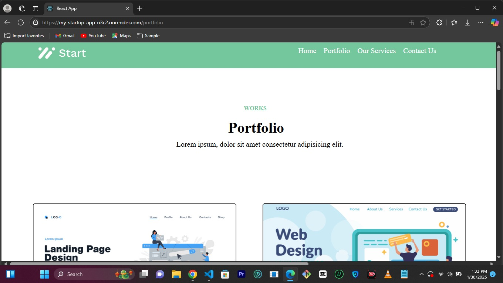
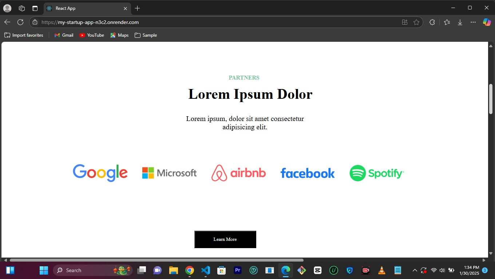
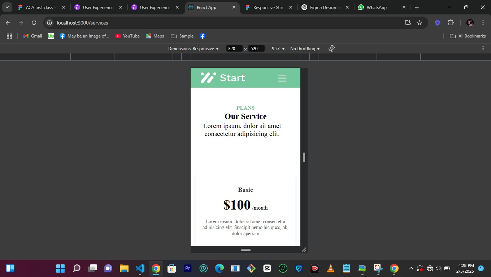
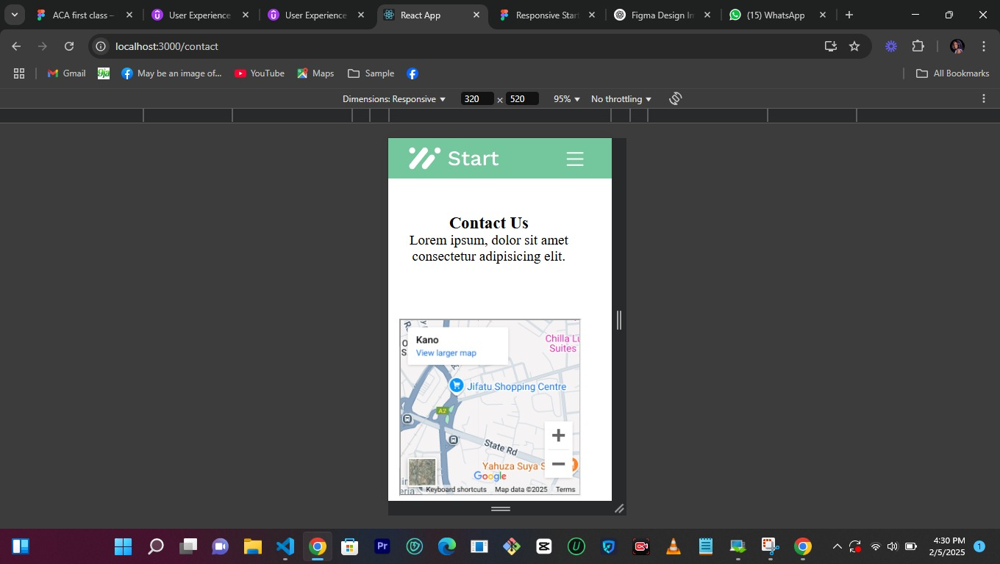

# Project Name

Startup. As the name implys is a startup website where portential customer can visit and see companys portfolio, services and contact. 


## Table of Contents

- [Project Name](#Startup)
- [Table of Contents](#table-of-contents)

  - [Introduction](#introduction)

  - [Live Demo](#live-demo)

  - [Features](#features)

  - [Technologies Used](#technologies-used)

  - [Setup and Installation](#setup-and-installation)

  - [Usage](#usage)

  - [Screenshots](#screenshots)

  - [License](#license)

  - [Author(s)](#authors)


## Introduction

Startup website has one purpose, to help customer has a feel good experience and at the same time engage with the verious services render.


## Live Demo

 [Live Demo](https://my-startup-app-6tms.onrender.com)

 [live Demo 2](https://startup-06ga.onrender.com)

 [Presentation](https://www.loom.com/share/fb40af55b7c44417b316106427c308ea?sid=ee8e8697-0a7c-4a74-bef2-0b510e69543b)


## Features

- Homepage.

- Portfolio.

- Our Service.

- Contact Us.


## Technologies Used

- HTML

- CSS

- JavaScript

-  React


## Setup and Installation
## ** Prerequistion**


-node.js installed
-npm (Node package manager) or yarn


1\. **Clone the repository:**


    git clone https://github.com/Gimbalgal/my-startup.git

    ```

2\. **Navigate to the project directory:**

    ```bash

    cd React App

    
 **Run the project:**


    npm start

    or if you are using yarn:

    ```bash

    yarn start

    ```

## Usage

The website is hosted on the web, and anyone who has access to a smart device and internet can use it.


## Screenshots

Include screenshots or GIFs of your project in action. This helps users understand what your project looks like and how it functions.







## License


This project is licensed under the MIT License - see the [LICENSE](LICENSE) file for details.


## Author(s)

Provide information on the authors of the project. Include names, email addresses, and links to GitHub profiles or other relevant profiles.

- **Name:** Victoria Augustine Ishabo

- **Email:** victoriaishabo55@gmail.com

- **GitHub:** [your-username](https://github.com/Gimbalgal)


